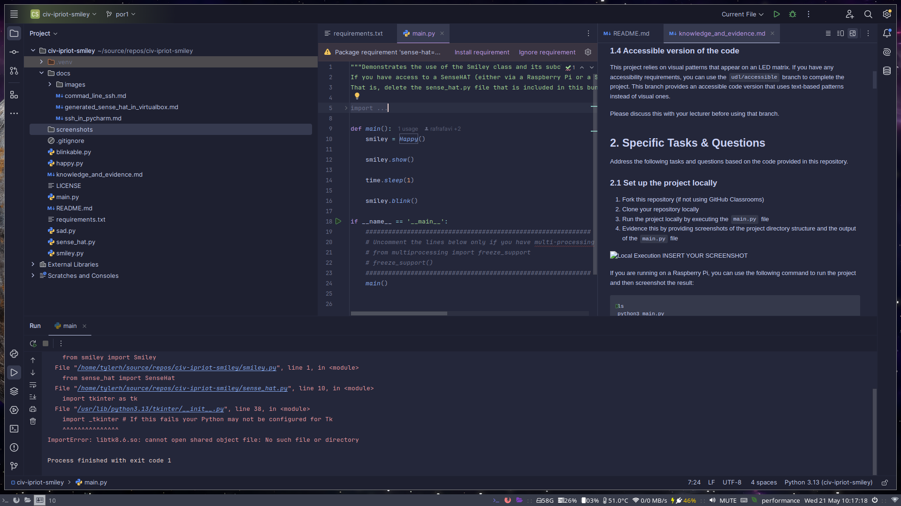
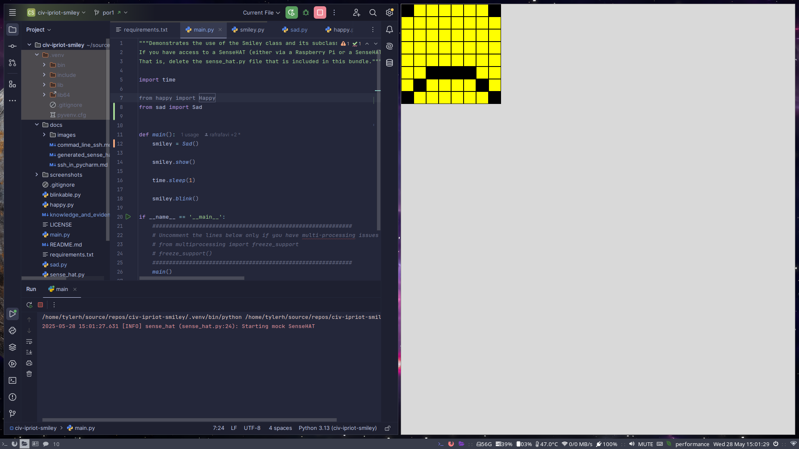
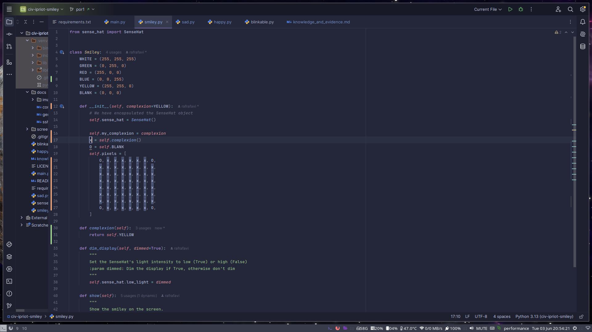

<style>

body {
    counter-reset: h2counter;
}

/* H1 - No numbering */
h1 {
    /* No counter reset or increment */
}

/* H2 - Level 1 numbering */
h2 {
    counter-reset: h3counter;
}

h2::before {
    counter-increment: h2counter;
    content: counter(h2counter) ". ";
}

/* H3 - Level 2 numbering */
h3 {
    counter-reset: h4counter;
}

h3::before {
    counter-increment: h3counter;
    content: counter(h2counter) "." counter(h3counter) " ";
}

/* H4 - Level 3 numbering (optional) */
h4 {
    counter-reset: h5counter;
}

h4::before {
    counter-increment: h4counter;
    content: counter(h2counter) "." counter(h3counter) "." counter(h4counter) " ";
}

</style>

# Evidence and Knowledge

This document includes instructions and knowledge questions that must be completed to receive a *Competent* grade on this portfolio task.

## Required evidence

### Answer all questions in this document

- Each answer should be complete, well-articulated, and within the specified word count limits (if added) for each question.
- Please make sure **all** external sources are properly cited.
- You must **use your own words**. Please include your full chat transcripts if you use generative AI in any way.
- Generative AI hallucinates, is not an authoritative source

### Make all the required modifications to the code

- Please follow the instructions in this document to make the changes needed to the code.

- When requested to upload evidence, upload all screenshots to `screenshots/` and embed them in this document. For example:

```markdown

```

- You must upload the code into your GitHub repository.
- While you can use a branch, your code should be in main when you submit.
- Upload a zip of this repository to Blackboard when you are ready to submit.
- You will be notified of your result via Blackboard
- However, if using GitHub classrooms, you may also receive additional feedback on GitHub directly

### Optional: Use of Raspberry Pi and SenseHat

Raspberry Pi or SenseHat is **optional** for this activity. You can use the included `sense_hat.py` file to simulate the SenseHat on your computer.

If you use a Pi, please **delete** the `sense_hat.py` file.

### Accessible version of the code

This project relies on visual patterns that appear on an LED matrix. If you have any accessibility requirements, you can use the `udl/accessible` branch to complete the project. This branch provides an accessible code version that uses text-based patterns instead of visual ones.

Please discuss this with your lecturer before using that branch.

## Specific Tasks & Questions

Address the following tasks and questions based on the code provided in this repository.

### Set up the project locally

1. Fork this repository (if not using GitHub Classrooms)
2. Clone your repository locally
3. Run the project locally by executing the `main.py` file
4. Evidence this by providing screenshots of the project directory structure and the output of the `main.py` file



If you are running on a Raspberry Pi, you can use the following command to run the project and then screenshot the result:

```bash
ls
python3 main.py
```

### Fundamental code comprehension

 Answer each of the following questions **as they relate to that code** supplied by in this repository (ignore `sense_hat.py`):

1. Examine the code for the `smiley.py` file and provide  an example of a variable of each of the following types and their corresponding values (`_` should be replaced with the appropriate values):

   | Type                    | name   | value           |
   |-------------------------|--------|-----------------|
   | built-in primitive type | RED[0] | 255             | `<!--Part of RED which is of composite type list-->
   | built-in composite type | WHITE  | (255, 255, 255) |
   | user-defined type       | Smiley | N/A             |

2. Fill in (`_`) the following table based on the code in `smiley.py`:

   | Object                  | Type   |
   |-------------------------|--------|
   | self.pixels             | tuple  |
   | A member of self.pixels | int    |
   | self                    | Smiley |

3. Examine the code for `smiley.py`, `sad.py`, and `happy.py`. Give an example of each of the following control structures using an example from **each** of these files. Include the first line and the line range:

   | Control Flow | File     | First line | Line range |
   |--------------|----------|------------|------------|
   | sequence     | happy.py | 39         | 43         |
   | selection    | sad.py   | 26         | 29         |
   | iteration    | happy.py | 21         | 22         |

4. Though everything in Python is an object, it is sometimes said to have four "primitive" types. Examining the three files `smiley.py`, `sad.py`, and `happy.py`, identify which of the following types are used in any of these files, and give an example of each (use an example from the code, if applicable, otherwise provide an example of your own):

   | Type  | Used? | Example                                   |
   |-------|-------|-------------------------------------------|
   | int   | True  | `Smiley.WHITE[0]`                         |
   | float | True  | `Happy.Blink()` `delay` parameter         |
   | str   | True  | `Smiley.dim_display()` docstring          |
   | bool  | True  | `Smiley.dim_display()` `dimmed` parameter |

5. Examining `smiley.py`, provide an example of a class variable and an instance variable (attribute). Explain **why** one is defined as a class variable and the other as an instance variable.
    > The variables `WHITE`, `GREEN`, `RED`, `YELLOW`, and `BLANK` are class variables of the `Smiley` class as they're declared within the class itself not the constructor.
    > 
    > The collection variable `pixels` is created when creating an instance of the Smiley class using the constructor method and is thus an instance variable.
    >
    > Presumably this is because the value of `YELLOW` for example is to be the same for all instances, it shouldn't be changed as it's a constant, but if it were, the change would affect all instances that use `Smiley.YELLOW`, whereas the `pixels` are expected to be modified and differ between instances. 

6. Examine `happy.py`, and identify the constructor (initializer) for the `Happy` class: 
   1. What is the purpose of a constructor (in general) and this one (in particular)?
       > Generally, a constructor is used to provide a clean and reusable means of creating an instance of a class.
       > 
       > This particular constructor additionally uses the `super()` function with the `.__init__()` method to invoke the super classes' constructors, the values of which are then used to populate the child class.

   2. What statement(s) does it execute (consider the `super` call), and what is the result?
       > Firstly, it invokes the superclass' constructor using `super().__init)__()` which is used to populate the subclass instance.
       > 
       > Secondly, it runs the methods `draw_mouth()` and `draw_eyes()` from the `self` object which is simply a reference to current class instance and the prior stated methods.

### Code style

1. What code style is used in the code? Is it likely to be the same as the code style used in the SenseHat? Give to reasons as to why/why not:
    > The code seemingly follows the style guide from the PEP 8 standard, as indicated by 4 space indentation, variable names, and line length.
    >
    > The SenseHat code, however, has lines far longer than 79 characters and docstrings far longer than 72 and variable names that aren't indicative of their content.
    > 
    > This potentially suggests that the SenseHat, despite some similar aspects, potentially different styleguide.

2. List three aspects of this convention you see applied in the code.
    > 1. Variable naming style:
    >    * Variables are descriptively named
    >    * Variables follow the snake case and screaming snake case guidelines.
    > 2. Line length:
    >    * Lines do not exceed 79 characters in length (or 72 for long blocks of text).
    > 3. Indentation:
    >   * Indented lines are indented with 4 space characters rather than 2 space characters or a tab character.

3. Give two examples of organizational documentation in the code.
    > 1. Use of docstrings in function declarations.
    > 2. Use of reST conventions within docstrings.

### Identifying and understanding classes

> Note: Ignore the `sense_hat.py` file when answering the questions below

1. List all the classes you identified in the project. Indicate which classes are base classes and which are subclasses. For subclasses, identify all direct base classes.
  
    Use the following table for your answers:

    | Class Name  | Super or Sub? | Direct parent(s)      |
    |-------------|---------------|-----------------------|
    | `Smiley`    | Super         | N/A                   |
    | `Blinkable` | Sub           | `ABC`                 |
    | `Sad`       | Sub           | `Smiley`, `Blinkable` |
    | `Happy`     | Sub           | `Smiley`, `Blinkable` |

2. Explain the concept of abstraction, giving an example from the project (note "implementing an ABC" is **not** in itself an example of abstraction). (Max 150 words)
    > Abstraction refers to hiding away the actual implementation of an object, only exposing what's relevant within the current scope, which lends to ease of use, code reusability, and encapsulation.
    >
    > For example, this program abstractifies away the process of creating, showing, and dimming the pixel grid to the `Smiley` superclass.
    > 
    > This provides a reusable, consistent implementation of the foundational variables and functions that various parts of the program, namely the `Happy` & `Sad` subclasses, can interact with and manipulate.

3. What is the name of the process of deriving from base classes? What is its purpose in this project? (Max 150 words)
    > the process of deriving from base classes is generally referred to as inheriting.
    >
    > In this project, inheriting is used to define a common interface such as with the `Blinkable` class, or to provide functionality several classes depend on within a single class that they may inherit from, such as with the `Smiley` class

### Compare and contrast classes

Compare and contrast the classes Happy and Sad.

1. What is the key difference between the two classes?
   > See 2.5.3

2. What are the key similarities?
   > Both classes have implementations of the functions `draw_mouth()` and `draw_eyes()`.

3. What difference stands out the most to you and why?
   > The `Happy` class inherits from the interface class `Blinkable` and has implemented the `blink()` function, the sad class does not and has not.
   
4. How does this difference affect the functionality of these classes?
   > Instances of the `Happy` class *can* blink, however instances of the `Sad` class *cannot*.

### Where is the Sense(Hat) in the code?

1. Which class(es) utilize the functionality of the SenseHat?
   > The `Smiley` class, and thus, all of its subclasses.

2. Which of these classes directly interact with the SenseHat functionalities?
   > *Only* the `Smiley` class, as upon initializing its constructor, it encapsulates an instance of the SenseHat class within the `sense_hat` attribute, nowhere else *directly* interacts with SenseHat's functionalities. 

3. Discuss the hiding of the SenseHAT in terms of encapsulation (100-200 Words)
   > The hiding of SenseHat within `Smiley` means, 
   > so long as we define methods that can interact with SenseHat and provide the functionality `Smiley` subclasses require, 
   > we can ensure that other classes need not directly interact with SenseHat functionality at all.
   > 
   > As such, we can say SenseHat functionality is "encapsulated" within `Smiley`.
   > 
   > Additionally, since we only create a SenseHat instance and assign it to a variable within `Smiley`'s constructor,
   > we further encapsulate the SenseHat object itself to the current instance, and avoid potential complications relating to class attributes.
   >
   > In theory this all keeps everything self-contained, and potentially, modular.

### Sad Smileys Can’t Blink (Or Can They?)

Unlike the `Happy` smiley, the current implementation of the `Sad` smiley does not possess the ability to blink. Let's first explore how blinking has been implemented in the Happy Smiley by examining the blink() method, which takes one argument that determines the duration of the blink.

1. **Understanding Blink Mechanism:**
    1. Does the code's author believe that every `Smiley` should be able to blink? Explain.
        > No, as not all subclasses of `Smiley` inherit from `blinkable`, currently, only the subclass `Happy` does.
    
    2. For those smileys that blink, does the author expect them to blink in the same way? Explain.
        > No, as the use of an abstract method indicates the author expects subclasses to provide their own implementation.
        > 
        > If every subclass was expected to have the same implementation, there would be little reason not to implement the functionality in `Blinkable` itself.
    
    3. Referring to the implementation of blink in the Happy and Sad Smiley classes, give a brief explanation of what polymorphism is.
        > Polymorphism is a pillar of OOP that posits objects of related types should share a common interface, that likely *will not have **the same*** implementation for every related type, but it *will have **an*** implementation for every related type.
        >
        > Meaning if we decide `Sad` should share the ability to blink and inherit from `Blinkable`, we can implement it in a manner that we deem most appropriate for **this** type of object.
        > 
        > Perhaps we think a sad smiley should have a different implementation of blinking, that's fine, just so long as it provides functionality for what was inherited from the abstract.

    4. How is inheritance used in the blink method, and why is it important for polymorphism?
        > This superclass doesn't actually provide any implementation for the `blink()` method, rather, by inheriting from `Blinkable`, a given subclass simply inherits an empty method that it promises to *provide* the functionality for within the subclass.
        > 
        > This means that differing subclasses can provide implementation as it makes sense for that subclass.
        >
        > This is important for polymorphism as attempting to handle every related type the same way often creates more problems than it fixes, allowing for differing implementations that share a common interface but provide functionality relevant to the type avoids this problem.

2. **Implement Blink in Sad Class:**
   - Create a new method called `blink` within the Sad class. Ensure you use the same method signature as in the Happy class:

     ```python
     def blink(self, delay=0.25):
         ...
     ```

3. **Code Implementation:**
   - Implement the code that allows the Sad smiley to blink. Use the implementation from the Happy Smiley as a reference. Ensure your new method functions similarly by controlling the blink duration through the `delay` argument.
     ```python
     def blink(self, delay=0.25):
         show_eye = False
         for i in range(2):
             self.draw_eyes(wide_open=show_eye)
             self.show()
             time.sleep(delay)
             show_eye = not show_eye
     ```
     
4. **Testing the Implementation:**
   - Test the new blink functionality on your Raspberry Pi or within the Python classes provided. You might need to adjust the `main.py` script to incorporate Sad Smiley's new blinking capability.

    Include a screenshot of the sad smiley or the modified `main.py`:
    
    
    
    - Observe and document the Sad smiley as it blinks its eyes. Describe any adjustments or issues encountered during implementation.
    
      > It blinks! Issues were mostly related to attempting to create a differing implementation simply for the sake of it.

### If It Walks Like a Duck…

Previously, you implemented the blink functionality for the Sad smiley without utilizing the class `Blinkable`. Assuming you did not use `Blinkable` (even if you actually did), consider how the Sad smiley could blink similarly to the Happy smiley without this specific class.

1. **Class Type Analysis:** What kind of class is `Blinkable`? Inspect its superclass for clues about its classification.
    > Abstract.

2. **Class Implementation:** `Blinkable` is a class intended to be implemented by other classes. What generic term describes this kind of class, which is designed for implementation by others? **Clue**: Notice the lack of any concrete implementation and the naming convention.
    > Interface.

3. **OO Principle Identification:** Regarding your answer to question (2), which Object-Oriented (OO) principle does this represent? Choose from the following and justify your answer in 1-2 sentences: Abstraction, Polymorphism, Inheritance, Encapsulation.
    > Polymorphism, as it means one may use the same method for objects of many types so long as they belong to the same abstract class (i.e. belong to the same group of related types).
 
4. **Implementation Flexibility:** Explain why you could grant the Sad Smiley a blinking feature similar to the Happy Smiley's implementation, even without directly using `Blinkable`.
    > Inheriting from `Blinkable` simply provides an empty method to be defined, but this abstract class only provides a standard template, you can still define a method with the same name and signature without it, it's just useful to enforce a common convention.

5. **Concept and Language Specificity:** In relation to your response to question (4), what is this capability known as, and why is it feasible in Python and many other dynamically typed languages but not in most statically typed programming languages like C#? **Clue** This concept is hinted at in the title of this section.
    > Duck typing, which means a given object can be treated as an instance of a given type simply so long as it has the required methods and properties. To be tongue-in-cheek, if it has the methods of a `Duck`, and the properties of a `Duck`, then it may be treated as a `Duck`.
    >
    > This is as opposed to normative typing which **requires** explicit declaration that an object is of a given type.

  ***

  ## Refactoring

  ### Does a Smiley Have to Be Yellow?

  While our current implementation predominantly features yellow smileys, emotional expressions like sickness or anger typically utilize colors like green, red, or orange. We'll explore the feasibility of integrating these colors into our smileys.

1. **Defined Colors and Their Location:**

   1. Which colors are defined and in which class(s)?
        > White, green, red, yellow, and black are all defined as attributes of the smiley class
   2. What type of variables hold these colors? Are the values expected to change during the program's execution? Explain your answer.
        > These colors are stored as constants, indicated by the use of screaming snake case.
        >
        > As the name implies, a *constant* should remain *constant* regardless of the program's current state, this is as opposed to *variables* which are expected to be, well, *variable*.
   3. Add the color blue to the appropriate class using the appropriate format and values.

  2. **Usage of Color Variables:**

     1. In which classes are the color variables used?
        > Only the`Smiley` class.

  3. **Simple Method to Change Colors:**
     1. What is the easiest way you can think to change the smileys to green? Easiest, not necessarily the best!
        > Set `YELLOW[0]` to 0
        
  ### Flexible Colors – Step 1

  Changing the color of the smileys once is straightforward, but it isn't very flexible. To facilitate various colors for smileys, it is advisable not to hardcode values in any class. This approach was identified earlier as a necessary change. Let's start by removing the built-in assumptions about color in our classes.

  1. **Add a method called `complexion` to the `Smiley` class:** Implement this instance method to return `self.YELLOW`. Using the term "complexion" instead of "color" provides a more abstract terminology that focuses on the meaning rather than implementation.

  2. **Refactor subclasses to use the `complexion` method:** Modify any subclass that directly accesses the color variable to instead utilize the new `complexion` method. This ensures that color handling is centralized and can be easily modified in the future.

  3. **Determine the applicable Object-Oriented principle:** Consider whether *Abstraction*, Polymorphism, Inheritance, or Encapsulation best applies to the modifications made in this step.

  4. **Verify the implementation:** Ensure that the modifications function as expected. The smileys should still display in yellow, confirming that the new method correctly replaces the direct color references.

  This step is crucial for setting up a more flexible system for color management in the smiley display logic, allowing for easy adjustments and extensions in the future.
Y
  ### Flexible Colors – Step 2

  Having removed the hardcoded color values, we now enhance the base class to support dynamic color assignments more effectively.

  1. **Modify the `__init__()` method in the `Smiley` class:** Introduce a default argument named `complexion` and assign `YELLOW` as its default value. This allows the instantiation of smileys with customizable colors.

  2. **Introduce a new instance variable:** Create a variable called `my_complexion` and assign the `complexion` parameter to it. This step ensures that each smiley instance can maintain its own color state.

  3. **Rationale for `my_complexion`:** Using a distinct instance variable like `my_complexion` avoids potential conflicts with the method parameter names and clarifies that it is an attribute specific to the object.

  4. **Bulk rename:** We want to update our grid to use the value of complexion, but we have so many `Y`'s in the grid. Use your IDE's refactoring tool to rename all instances of the **symbol** `Y` to `X`. Where `X` is the value of the `complexion` variable. Include a screenshot evidencing you have found the correct refactor tool and the changes made.

  

  5. **Update the `complexion` method:** Adjust this method to return `self.my_complexion`, ensuring that whatever color is assigned during instantiation is what the smiley displays.

  6. **Verification:** Run the updated code to confirm that Smileys still defaults to yellow unless specified otherwise.

  ### Flexible Colors – Step 3

  With the foundational changes in place, it's now possible to implement varied smiley colors for different emotional expressions.

  1. **Adjust the `Sad` class initialization:** In the `Sad` class's initializer method, change the superclass call to include the `complexion` argument with the value `self.BLUE`, as shown:

     ```python
     super().__init__(complexion=self.BLUE)
     ```

  2. **Test color functionality for the Sad smiley:** Execute the program to verify that the Sad smiley now appears blue.

  3. **Ensure the Happy smiley remains yellow:** Confirm that changes to the Sad smiley do not affect the default color of the Happy smiley, which should still display in yellow.

  4. **Design and Implement An Angry Smiley:** Create an Angry smiley class that inherits from the `Smiley` class. Set the color of the Angry smiley to red by passing `self.RED` as the `complexion` argument in the superclass call.

  ***
